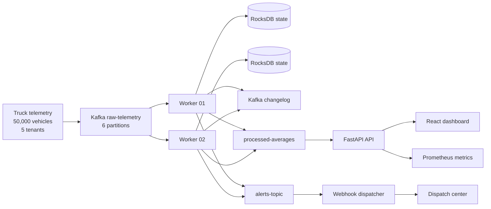

# Architecture Overview

## 1. System view

StreamForge is a distributed stream processing system designed for cold-chain telemetry. It combines Kafka for durable event transport, local worker state for windowed aggregation, and a FastAPI + React observability layer for operational visibility.

## 2. Why this architecture

- Ingestion is decoupled from processing through Kafka, which provides buffering and partitioned fan-out.
- Worker-local RocksDB state keeps hot-path reads and writes fast for per-truck rolling windows.
- Kafka changelogs provide a durable recovery path after crashes, so state can be rebuilt without data loss.
- The API and dashboard layer is separated from the processing plane, allowing real-time querying without slowing down stream computation.

## 3. Processing flow

1. Telemetry is emitted from trucks and sent to the raw Kafka topic.
2. Worker instances process partitions by deterministic truck key to maintain ordering per vehicle.
3. Each worker updates rolling-window aggregates and checks threshold breaches.
4. Alerts are emitted to a downstream alert topic and webhook dispatcher.
5. Aggregated data is exposed through the API and UI for monitoring and incident analysis.

## 4. Operational goals

- Sub-second anomaly detection for out-of-range temperature conditions.
- Durable recovery from worker failure with no state loss.
- Horizontal worker scaling with partition-based load distribution.
- Real-time observability through metrics and dashboard views.
