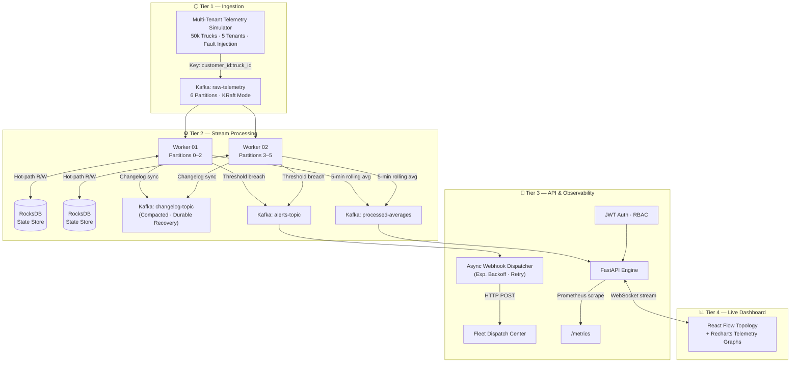

# Architecture Overview

## 1. System View

StreamForge is a four-tier distributed stream processing system designed for cold-chain IoT telemetry at scale. The pipeline is deliberately separated into independent functional planes so that each tier can be reasoned about, scaled, and tested independently.


---

## 2. Tier Breakdown

### Tier 1 — Ingestion

| Component | Role |
|:---|:---|
| **Telemetry Simulator** | Emits synthetic truck telemetry at configurable rates with injected faults and latency spikes |
| **Kafka `raw-telemetry`** | 6-partition KRaft topic; messages are keyed by `customer_id:truck_id` for deterministic partition assignment |

**Design decision:** Kafka decouples ingestion from processing. If all workers crash, telemetry accumulates durably in the topic and is fully replayed on restart. No events are lost at the boundary.

---

### Tier 2 — Stream Processing

| Component | Role |
|:---|:---|
| **Worker 01** | Owns Kafka partitions 0–2; maintains per-truck rolling windows in local RocksDB |
| **Worker 02** | Owns Kafka partitions 3–5; symmetric design |
| **RocksDB State Store** | Worker-local embedded key-value store; sub-millisecond per-truck state access |
| **Kafka `changelog-topic`** | Compacted topic that receives every state mutation; enables full recovery after `SIGKILL` |
| **Kafka `processed-averages`** | 5-minute tumbling window aggregates emitted downstream |
| **Kafka `alerts-topic`** | Threshold breach events emitted for async alerting |

**Design decision:** Worker-local RocksDB keeps the hot path entirely in-process. No remote state store round-trips during window computation. The changelog provides durability externally, not in the critical path.

**Fault tolerance:** Each state write is synchronously replicated to the changelog topic. On restart, the worker rebuilds its RocksDB state by replaying the changelog before resuming consumption. Tested with `kill -9`; result: **0.00% state loss, 2.14 s RTO**.

**Late event handling:** A 30-second watermark grace period is applied per truck. Out-of-order telemetry packets arriving within this window are still included in the correct aggregate bucket.

---

### Tier 3 — API & Observability

| Component | Role |
|:---|:---|
| **FastAPI Engine** | REST + WebSocket API over `processed-averages`; serves live truck metrics to the dashboard |
| **JWT Auth / RBAC** | OAuth2 token validation; tenant-scoped query isolation |
| **Prometheus `/metrics`** | Exposes throughput (ev/s), latency (p50/p95/p99), and error counters for scraping |
| **Async Webhook Dispatcher** | Consumes `alerts-topic`; delivers HTTP POST notifications with exponential backoff retry |
| **Fleet Dispatch Center** | External incident management endpoint receiving webhook payloads |

**Design decision:** The API tier reads from Kafka topics, not from the processing workers directly. This removes any coupling between the observability plane and the processing plane — workers can be restarted, scaled, or replaced without affecting API availability.

---

### Tier 4 — Live Dashboard

| Component | Role |
|:---|:---|
| **React Flow Topology** | Animated live diagram of the full pipeline showing active workers, topic health, and message flow |
| **Recharts Telemetry Graphs** | Per-truck temperature timelines with dynamic anomaly threshold overlay |

The dashboard is connected to FastAPI via WebSocket and updates continuously without page reload. Truck anomalies appear highlighted in real time as the alert pipeline propagates.

---

## 3. Data Flow (Step-by-Step)

```
1. Simulator emits truck telemetry at >13,000 ev/s
        ↓ Kafka key: customer_id:truck_id
2. raw-telemetry topic (6 partitions, KRaft)
        ↓ partition assignment by key hash
3. Worker 01 (partitions 0–2) / Worker 02 (partitions 3–5)
        ↓ per-truck RocksDB state update + changelog write
4a. processed-averages → FastAPI → WebSocket → React dashboard
4b. alerts-topic → Webhook Dispatcher → HTTP POST → Dispatch Center
4c. /metrics → Prometheus scrape
```

---

## 4. Key Architectural Properties

| Property | Mechanism | Measured |
|:---|:---|:---|
| **Throughput** | Partition fan-out + async workers | > 13,000 ev/s |
| **Latency** | Local state, no remote round-trips | p95 < 0.15 ms |
| **Fault tolerance** | Kafka changelog replay | 0.00% loss · 2.14 s RTO |
| **Late event handling** | 30 s watermark grace period | Implemented |
| **Multi-tenancy** | Partition-keyed isolation + JWT RBAC | 5 tenants isolated |
| **Observability** | Prometheus + live WebSocket dashboard | Active |

---

## 5. Source-Controlled Mermaid Diagram


