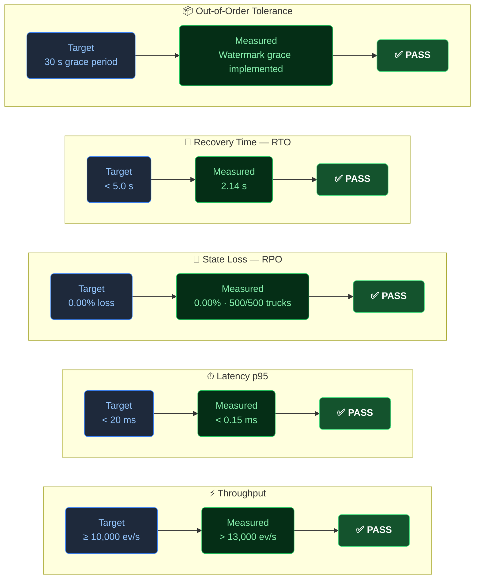

# Problem Statement

## 1. Business Problem

FleetPulse Analytics manages refrigerated transport for temperature-sensitive cargo — frozen vaccines, dairy, seafood, and fresh produce — across **50,000 trucks** operated by five enterprise tenants.

This cargo is regulated. It must remain within a strict thermal band (**−25 °C to −10 °C**). If a truck's refrigeration unit fails or drifts outside the safe range, irreversible spoilage begins within **30 minutes**. The consequences are severe:

| Impact Category | Consequence |
|:---|:---|
| **Product spoilage** | Entire trailer loads destroyed before the operator is alerted |
| **Financial loss** | Tens of thousands of dollars per incident in inventory and claims |
| **Regulatory exposure** | Cold-chain compliance violations, particularly for pharmaceutical cargo |
| **Customer trust** | Repeated failures erode SLA confidence and contract renewals |

The existing system processes telemetry as a **nightly batch ETL job**. Fleet managers receive anomaly reports approximately **12 hours after** the thermal event occurs. By that point, intervention is impossible. The damage is already done.

---

## 2. Root Cause: The Batch Gap

The 12-hour detection gap is an architectural problem, not an operational one. Batch processing is fundamentally incompatible with time-critical cold-chain monitoring. The core failure modes are:

- **No streaming pipeline**: Telemetry sits in object storage until the nightly job runs.
- **No per-truck state**: Aggregation happens over bulk data, not individual vehicle histories.
- **No anomaly engine**: Threshold breach detection is a post-hoc report, not a live trigger.
- **No fault tolerance**: Worker failures discard in-progress aggregation windows entirely.

---

## 3. Requirements for the Solution

The replacement system must satisfy the following capabilities:

| # | Requirement | Target |
|:--|:---|:---|
| R1 | Ingest telemetry from 50,000 trucks across 5 tenants | ≥ 10,000 events/sec sustained |
| R2 | Aggregate temperature over rolling time windows per truck | 5-minute tumbling window |
| R3 | Detect threshold breaches in near real time | < 1 second end-to-end |
| R4 | Tolerate delayed or out-of-order cellular telemetry packets | 30-second watermark grace period |
| R5 | Survive worker crashes with no state loss | 0.00% RPO · RTO < 5 s |
| R6 | Dispatch alerts to fleet dispatch centers automatically | Async HTTP POST with exponential retry |
| R7 | Expose live operational visibility to fleet operators | WebSocket-fed dashboard |
| R8 | Enforce tenant-level data isolation | JWT auth · partition-keyed RBAC |

---

## 4. Why StreamForge

StreamForge addresses these requirements by replacing the batch loop with a **continuous, stateful event stream**:

- Telemetry is ingested into Apache Kafka as events arrive, not hours later.
- Per-truck rolling windows are maintained in worker-local RocksDB state, giving sub-millisecond read/write access to hot aggregation data.
- Threshold breaches trigger an autonomous anomaly engine that dispatches webhook alerts to external dispatch centers within milliseconds.
- Kafka changelog replication ensures that if a worker is killed mid-window (`SIGKILL`), its state is fully restored from the durable changelog on restart — **0.00% data loss, verified** (RTO: 2.14 s).
- A FastAPI + React Flow dashboard gives fleet operators a live operational view of the entire pipeline.

This turns a slow, postmortem batch report into a **proactive real-time control loop** — catching compressor failures before cargo is lost.

---

## 5. Verified SLA Outcomes

Evidence: [`docs/evidence/chaos_failover_log.md`](evidence/chaos_failover_log.md) · [`docs/evidence/throughput_benchmark.md`](evidence/throughput_benchmark.md)
